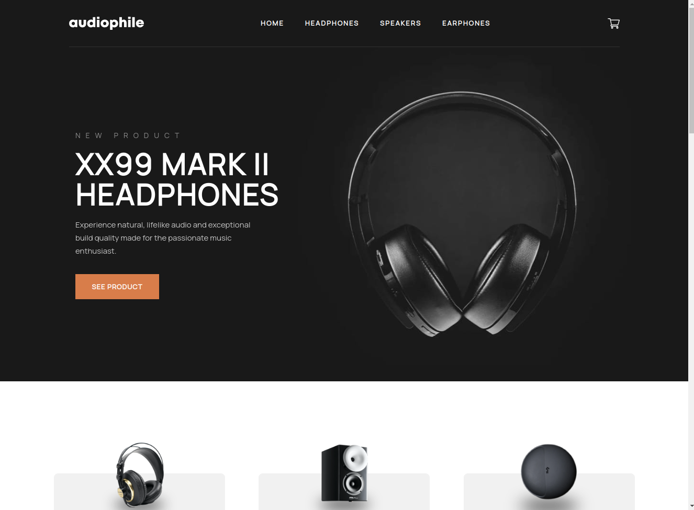
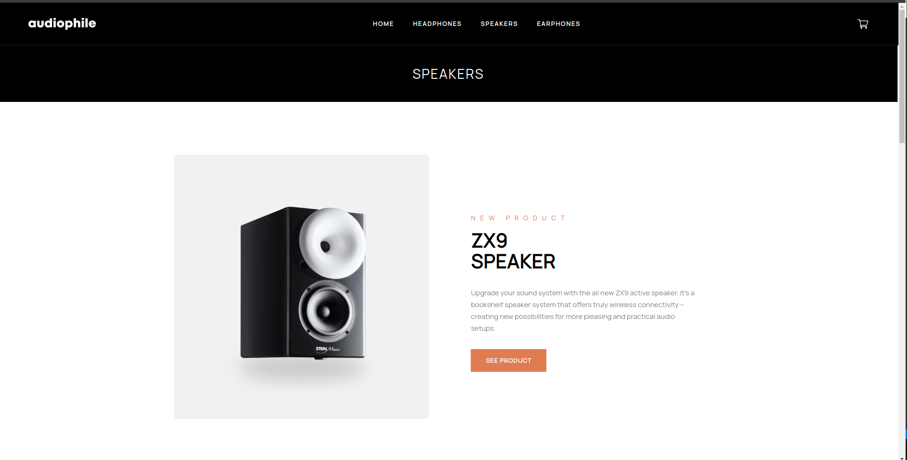
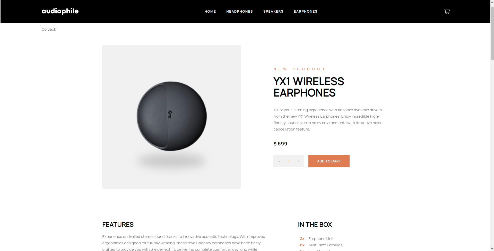
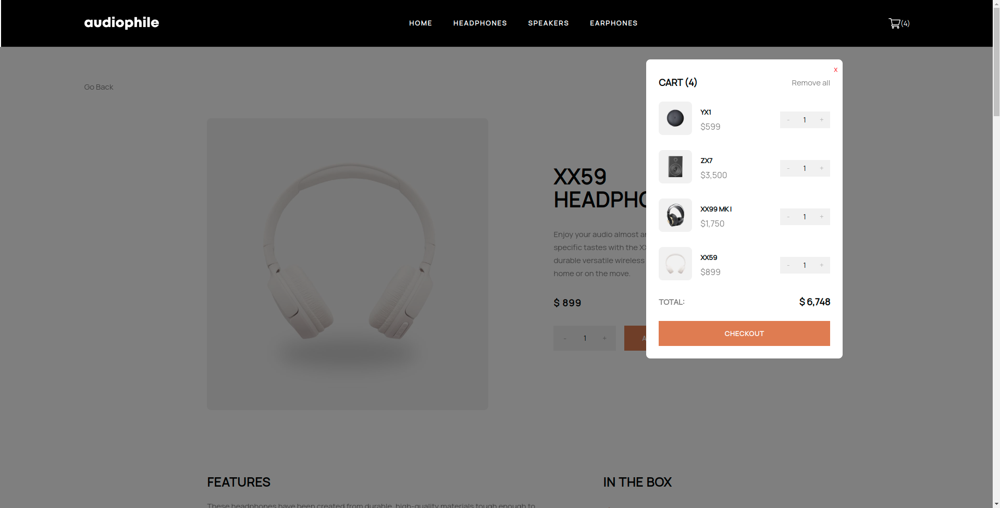
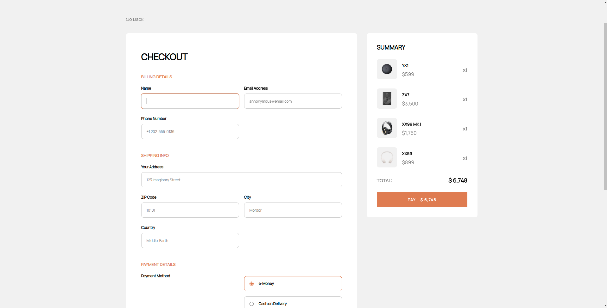

# Audiophile

A mock luxury audio equipment e-commerce store.

## About

Audiophile is an ecommerce store with a beautiful UI and smooth UX to keep customers attention and retention.  

The information for each product is stored in a database and served up to the front end from a custom API. I accomplished this by storing all the product information as JSON data in MongoDB.  I then built an API to serve this data to the front end using Node and Express.js.  The front end was built with React.js

Custom hooks fetch the data from the API and change the product images at media breakpoints. Context providers manage global state for the navbar and shopping cart. By using global state to manage the shopping cart, it was much easier to add CRUD functionality to the shopping cart.  After changes are complete, a simple saveCart() function is used to update the cart in both global state and Local Storage.

Check out the [audiophile-server-api](https://github.com/joshcamp503/audiophile-server-api) repo for more information about the backend.

This project is my solution to a challenge from frontendmentor.io, an online collection of coding challenges for developers to test and hone their skills with HTML, CSS, Javascript, and any framework(s) they choose to work with. Scroll down to see the README from frontendmentor.io to learn more about what the goals and expectations were for this challenge.

## Project Screen Shot(s)

## Live Demo

https://joshcamp.dev/audiophile

## Dependencies

*MongoDB

*Node.js

*Express.js

*React.js

## Authors

Josh Campanella  
[Portfolio](https://joshcamp.dev)

## Version History

* 0.1
    * Initial Release

## Acknowledgments

Inspiration, code snippets, etc.

* [MongoDB](https://www.mongodb.com/)
* [Node](https://nodejs.org/)
* [Express.js](https://expressjs.com/)
* [React.js](https://leafletjs.com/)
* [frontendmentor.io](https://www.frontendmentor.io/challenges/audiophile-ecommerce-website-C8cuSd_wx)

# README for this project directly from Frontend Mentor

# Frontend Mentor - Audiophile e-commerce website

## Welcome! 👋

Thanks for purchasing this premium Frontend Mentor coding challenge.

[Frontend Mentor](https://www.frontendmentor.io) challenges help you improve your coding skills by building realistic projects. These premium challenges are perfect portfolio pieces, so please feel free to use what you create in your portfolio to show others.

**To do this challenge, you need a strong understanding of HTML, CSS, and JavaScript.**

## The challenge

Your challenge is to build out this multi-page e-commerce website and get it looking as close to the design as possible.

You can use any tools you like to help you complete the challenge. So if you've got something you'd like to practice, feel free to give it a go.

If you choose to use a JS-heavy approach, we provide a local `data.json` file for the products. If you want to take it up a notch, feel free to build this as a full-stack application or use a headless CMS!

Your users should be able to:

- View the optimal layout for the app depending on their device's screen size
- See hover states for all interactive elements on the page
- Add/Remove products from the cart
- Edit product quantities in the cart
- Fill in all fields in the checkout
- Receive form validations if fields are missed or incorrect during checkout
- See correct checkout totals depending on the products in the cart
  - Shipping always adds $50 to the order
  - VAT is calculated as 20% of the product total, excluding shipping
- See an order confirmation modal after checking out with an order summary
- **Bonus**: Keep track of what's in the cart, even after refreshing the browser (`localStorage` could be used for this if you're not building out a full-stack app)

Want some support on the challenge? [Join our Slack community](https://www.frontendmentor.io/slack) and ask questions in the **#help** channel.

## Where to find everything

Your task is to build out the project to the design file provided. We provide both Sketch and Figma versions of the design, so you can choose which tool you prefer to use. You can download the design file on the platform. **Please be sure not to share them with anyone else.** The design download comes with a `README.md` file as well to help you get set up.

All the required assets for this project are in the `/assets` folder. The assets are already exported for the correct screen size and optimized. Some images are reusable at multiple screen sizes. So if you don't see an image in a specific folder, it will typically be in another folder for that page.

The design system in the design file will give you more information about the various colors, fonts, and styles used in this project.

We've prepared the challenge to let you choose your approach. We have separate `.html` files for all pages and products that include the content. However, if you prefer to practice a more JS-heavy approach, you could choose to use the local `data.json` and a library/framework like React, Vue, Angular, etc.

Feel free to edit the JSON structure however you like. If you want to practice working with a professional image hosting service, you could upload the images to a free [Cloudinary](https://cloudinary.com/) account and use their URLs instead of relative paths.

## Building your project

Feel free to use any workflow that you feel comfortable with. Below is a suggested process, but do not feel like you need to follow these steps:

1. Separate the `starter-code` from the rest of this project and rename it to something meaningful for you. Initialize the codebase as a public repository on [GitHub](https://github.com/). Creating a repo will make it easier to share your code with the community if you need help. If you're not sure how to do this, [have a read-through of this Try Git resource](https://try.github.io/). **⚠️ IMPORTANT ⚠️: There are already a couple of `.gitignore` files in this project. Please do not remove them or change the content of the files. If you create a brand new project, please use the `.gitignore` files provided in your new codebase. This is to avoid the accidental upload of the design files to GitHub. With these premium challenges, please be sure not to share the design files in your GitHub repo. Thanks!**
2. Configure your repository to publish your code to a web address. This will also be useful if you need some help during a challenge as you can share the URL for your project with your repo URL. There are a number of ways to do this, and we provide some recommendations below.
3. Look through the designs to start planning out how you'll tackle the project. This step is crucial to help you think ahead for CSS classes to create reusable styles.
4. Before adding any styles, structure your content with HTML. Writing your HTML first can help focus your attention on creating well-structured content.
5. Write out the base styles for your project, including general content styles, such as `font-family` and `font-size`.
6. Start adding styles to the top of the page and work down. Only move on to the next section once you're happy you've completed the area you're working on.

## Deploying your project

As mentioned above, there are many ways to host your project for free. Our recommend hosts are:

- [GitHub Pages](https://pages.github.com/)
- [Vercel](https://vercel.com/)
- [Netlify](https://www.netlify.com/)

You can host your site using one of these solutions or any of our other trusted providers. [Read more about our recommended and trusted hosts](https://medium.com/frontend-mentor/frontend-mentor-trusted-hosting-providers-bf000dfebe).

## Create a custom `README.md`

We strongly recommend overwriting this `README.md` with a custom one. We've provided a template inside the [`README-template.md`](./README-template.md) file in this starter code.

The template provides a guide for what to add. A custom `README` will help you explain your project and reflect on your learnings. Please feel free to edit our template as much as you like.

Once you've added your information to the template, delete this file and rename the `README-template.md` file to `README.md`. That will make it show up as your repository's README file.

## Submitting your solution

Submit your solution on the platform for the rest of the community to see. Follow our ["Complete guide to submitting solutions"](https://medium.com/frontend-mentor/a-complete-guide-to-submitting-solutions-on-frontend-mentor-ac6384162248) for tips on how to do this.

Remember, if you're looking for feedback on your solution, be sure to ask questions when submitting it. The more specific and detailed you are with your questions, the higher the chance you'll get valuable feedback from the community.

**⚠️ IMPORTANT ⚠️: With these premium challenges, please be sure not to upload the design files to GitHub when you're submitting to the platform and sharing it around. If you've created a brand new project, the easiest way to do that is to copy across the `.gitignore` provided in this starter project.**

## Sharing your solution

There are multiple places you can share your solution:

1. Share your solution page in the **#finished-projects** channel of the [Slack community](https://www.frontendmentor.io/slack). 
2. Tweet [@frontendmentor](https://twitter.com/frontendmentor) and mention **@frontendmentor**, including the repo and live URLs in the tweet. We'd love to take a look at what you've built and help share it around.
3. Share your solution on other social channels like LinkedIn.
4. Blog about your experience building your project. Writing about your workflow, technical choices, and talking through your code is a brilliant way to reinforce what you've learned. Great platforms to write on are [dev.to](https://dev.to/), [Hashnode](https://hashnode.com/), and [CodeNewbie](https://community.codenewbie.org/).

We provide templates to help you share your solution once you've submitted it on the platform. Please do edit them and include specific questions when you're looking for feedback. 

The more specific you are with your questions the more likely it is that another member of the community will give you feedback.

## Got feedback for us?

We love receiving feedback! We're always looking to improve our challenges and our platform. So if you have anything you'd like to mention, please email hi[at]frontendmentor[dot]io.

**Have fun building!** 🚀
